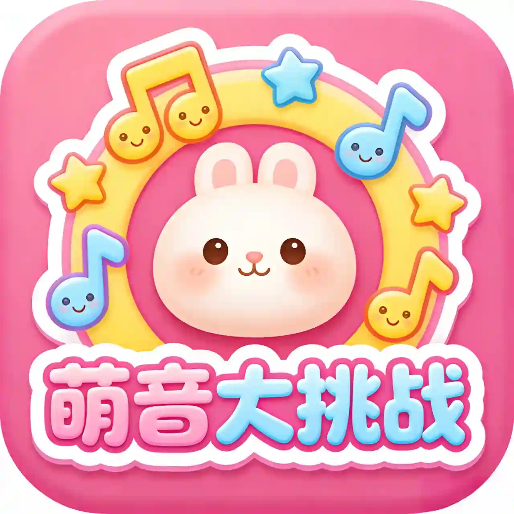

# 专注力训练营 (FocusBee)

<p align="center">
  
</p>

<p align="center">
  <a href="https://github.com/wangshaojie/FocusBee">
    
  </a>
  <a href="https://github.com/wangshaojie/FocusBee">
    
  </a>
  <a href="https://github.com/wangshaojie/FocusBee">
    
  </a>
</p>

> 帮助儿童和需要训练专注力的用户提升注意力、反应能力和记忆力

## 📋 目录

- [项目简介](#项目简介)
- [功能特点](#功能特点)
- [技术栈](#技术栈)
- [项目结构](#项目结构)
- [游戏介绍](#游戏介绍)
- [数据模型](#数据模型)
- [核心模块](#核心模块)
- [UI 设计](#ui-设计)
- [设置系统](#设置系统)
- [编译运行](#编译运行)
- [未来规划](#未来规划)
- [贡献指南](#贡献指南)
- [许可证](#许可证)

---

## 📖 项目简介

**专注力训练营 (FocusBee)** 是一款专为儿童设计的 Android 益智游戏应用，通过多个趣味小游戏帮助用户训练专注力、反应速度和短期记忆力。

### 设计理念

- 🎯 **儿童友好**: 界面简洁、色彩柔和、操作直观
- 🧠 **寓教于乐**: 在游戏中自然提升认知能力
- 📈 **渐进难度**: 从简单到困难，适合不同年龄段
- 🔊 **音效反馈**: 丰富的音效增强游戏体验

---

## ✨ 功能特点

### 核心功能

| 功能 | 描述 |
|------|------|
| 🎮 多个游戏 | 萌音大挑战、舒尔特训练、记忆翻牌 |
| ⭐ 积分系统 | 根据表现获得星星，累积积分 |
| 📊 进度追踪 | 记录每个游戏的完成情况 |
| 🎵 背景音乐 | 支持开关和音量控制 |
| ⚙️ 个性化设置 | 自动刷新间隔、音量调整 |
| 🔙 统一导航 | 简洁的顶部导航栏设计 |

### 游戏列表

1. **萌音大挑战** - 认识动物，听声音辨认知
2. **舒尔特训练** - 在网格中按顺序找数字，训练专注力
3. **记忆翻牌** - 翻牌配对，训练记忆力

---

## 🛠 技术栈

| 类别 | 技术 |
|------|------|
| **语言** | Kotlin 1.9.x |
| **最低 SDK** | API 24 (Android 7.0) |
| **目标 SDK** | API 34 (Android 14) |
| **UI 框架** | Jetpack Compose + XML (混用) |
| **架构** | MVVM + Clean Architecture |
| **状态管理** | StateFlow / Compose State |
| **依赖注入** | Manual DI (轻量级) |
| **数据存储** | DataStore Preferences |
| **异步处理** | Kotlin Coroutines + Flow |
| **构建工具** | Gradle 8.0 + AGP 8.1.0 |

---

## 📁 项目结构

```
FocusBee/
├── app/
│   ├── src/main/
│   │   ├── java/com/animalgame/
│   │   │   ├── core/              # 核心模块
│   │   │   │   ├── game/         # 游戏基础架构
│   │   │   │   │   ├── AbstractGameModule.kt
│   │   │   │   │   ├── GameAction.kt
│   │   │   │   │   ├── GameModule.kt
│   │   │   │   │   └── GameState.kt
│   │   │   │   ├── manager/      # 管理器
│   │   │   │   │   ├── GameRegistry.kt
│   │   │   │   │   ├── LevelManager.kt
│   │   │   │   │   ├── ScoreManager.kt
│   │   │   │   │   ├── SettingsManager.kt
│   │   │   │   │   └── RewardManager.kt
│   │   │   │   └── model/        # 数据模型
│   │   │   │       ├── GameResult.kt
│   │   │   │       ├── GameSettings.kt
│   │   │   │       ├── Medal.kt
│   │   │   │       └── UserProgress.kt
│   │   │   ├── games/            # 游戏模块
│   │   │   │   ├── animal/        # 萌音大挑战
│   │   │   │   ├── memory/        # 记忆翻牌
│   │   │   │   └── schulte/      # 舒尔特训练
│   │   │   └── ui/               # UI 层
│   │   │       ├── components/    # 可复用组件
│   │   │       │   └── GameTopBar.kt
│   │   │       ├── screens/      # 页面
│   │   │       ├── navigation/   # 导航
│   │   │       ├── HomeActivity.kt
│   │   │       └── SettingsActivity.kt
│   │   ├── res/                  # 资源文件
│   │   │   ├── drawable/         # 矢量图
│   │   │   ├── layout/           # XML 布局
│   │   │   ├── values/           # 颜色/字符串/尺寸
│   │   │   └── mipmap/           # 图标
│   │   └── assets/               # 静态资源
│   │       ├── logo.png
│   │       ├── logo1.png
│   │       └── music.mp3
│   └── build.gradle
├── gradle/
│   └── wrapper/
├── build.gradle
├── settings.gradle
├── gradle.properties
└── .gitignore
```

---

## 🎮 游戏介绍

### 1. 萌音大挑战 (Animal Sound)

**游戏规则**:
- 倒计时 3-2-1 后显示 8 个随机动物
- 必须包含: 狗、猫、羊（容易模仿叫声）
- 点击刷新按钮可重新随机

**动物列表**:
| 动物 |  emoji |
|------|--------|
| 狗   | 🐕    |
| 猫   | 🐱    |
| 羊   | 🐑    |
| 牛   | 🐮    |
| 猪   | 🐷    |
| 鸡   | 🐔    |
| 鸭   | 🐦    |
| 青蛙 | 🐸    |

**功能特性**:
- ✅ 倒计时动画
- ✅ 动物随机刷新
- ✅ 自动刷新功能（默认开启，10秒间隔）
- ✅ 背景音乐支持（受设置控制）

---

### 2. 舒尔特训练 (Schulte Table)

**游戏规则**:
- 在网格中按顺序点击数字 1 到最大
- 训练专注力和视觉搜索能力
- 完成时间越短，专注力越强

**难度级别**:
| 难度 | 网格大小 | 关卡数 |
|------|----------|--------|
| 简单 | 3×3      | 10 关  |
| 中等 | 4×4      | 10 关  |
| 困难 | 5×5      | 10 关  |
| 挑战 | 6×6      | 10 关  |

**功能特性**:
- ✅ 数字格子高亮显示
- ✅ 正确点击变绿色
- ✅ 错误点击红色闪烁（1秒恢复）
- ✅ 进度显示（当前数字/错误次数）
- ✅ 星级评价系统

---

### 3. 记忆翻牌 (Memory Game)

**游戏规则**:
- 翻牌找到相同的配对
- 训练短期记忆和注意力

**难度级别**:
| 难度 | 网格大小 | 卡牌数量 |
|------|----------|----------|
| 第1关 | 3×4     | 12 张   |
| 第2关 | 4×4     | 16 张   |
| 第3关 | 4×5     | 20 张   |
| 第4关 | 5×6     | 30 张   |

**功能特性**:
- ✅ 卡片翻转动画
- ✅ 配对成功/失败反馈
- ✅ 步数统计
- ✅ 星级评价系统

---

## 📊 数据模型

### GameResult (游戏结果)

```kotlin
data class GameResult(
    val gameId: String,      // 游戏ID
    val level: Int,          // 关卡编号
    val score: Int,          // 得分
    val stars: Int,          // 星级 (1-3)
    val isCompleted: Boolean, // 是否完成
    val timeMillis: Long,    // 耗时（毫秒）
    val mistakes: Int       // 错误次数
)
```

### GameSettings (游戏设置)

```kotlin
data class GameSettings(
    val soundVolume: Float = 1.0f,         // 音效音量
    val musicEnabled: Boolean = true,     // 音乐开关
    val vibrationEnabled: Boolean = true, // 震动开关
    val language: String = "zh",          // 语言
    val defaultDifficulty: String = "easy",// 默认难度
    val iconTheme: String = "default"     // 图标主题
)
```

### GameState (游戏状态)

```kotlin
sealed class GameState {
    data object Idle      // 等待开始 - 显示关卡选择
    data class Ready(...) // 准备中 - 倒计时
    data class Playing(...) // 游戏进行中
    data class Paused(...)  // 暂停
    data class Completed(...) // 游戏完成
    data class AllCompleted(...) // 全部通关
}
```

---

## 🔧 核心模块

### GameModule (游戏模块基类)

所有游戏都继承自 `AbstractGameModule`，提供统一的接口：

```kotlin
abstract class AbstractGameModule {
    abstract val gameId: String
    abstract val gameName: String
    abstract val totalLevels: Int

    val state: StateFlow<GameState>
    val result: SharedFlow<GameResult>

    fun start(level: Int)
    fun onUserAction(action: GameAction)
    fun calculateStars(timeMillis, mistakes, level): Int
}
```

### GameRegistry (游戏注册中心)

```kotlin
object GameRegistry {
    fun register(module: AbstractGameModule)
    fun getModule(gameId: String): AbstractGameModule?
    fun getAllModules(): List<AbstractGameModule>
}
```

### ScoreManager (积分管理器)

```kotlin
object ScoreManager {
    suspend fun reportResult(result: GameResult)
    fun getTotalScore(): Int
    fun getBestScore(gameId: String): Int
    fun getStars(gameId: String, level: Int): Int
}
```

### SettingsManager (设置管理器)

```kotlin
object SettingsManager {
    fun getSettingsFlow(context: Context): Flow<GameSettings>
    suspend fun updateSoundVolume(context, volume)
    suspend fun updateMusicEnabled(context, enabled)
    suspend fun updateSettings(context, settings)
}
```

---

## 🎨 UI 设计

### 整体风格

- **儿童友好**: 明亮柔和的色彩，避免高对比强刺激
- **统一设计**: 统一的间距 (8dp) 和圆角 (12px)
- **可爱风格**: 使用卡通图标和emoji

### 颜色方案

| 用途 | 颜色代码 |
|------|----------|
| 背景渐变 | #E8F4FD → #F3E8FD |
| 卡片背景 | #FFFFFF |
| 主色调 | #64B5F6 |
| 成功色 | #81C784 |
| 错误色 | #E57373 |
| 积分金色 | #FFD700 |

### GameTopBar (统一顶部导航)

```kotlin
@Composable
fun GameTopBar(
    title: String,
    level: Int = 0,
    score: Int = 0,
    stars: Int = 0,
    onBack: () -> Unit
)
```

特点:
- 左侧: 返回按钮
- 中间: 游戏标题 + 关卡信息
- 右侧: 分数 + 星级显示

---

## ⚙️ 设置系统

### 设置页面功能

1. **音乐开关**: 控制全局背景音乐
2. **音量调节**: 调整音效大小 (0-100%)
3. **自动刷新**: 萌音大挑战的自动刷新开关
4. **刷新间隔**: 自动刷新时间间隔 (1-999秒)

### 设置持久化

使用 **DataStore Preferences** 进行数据持久化，确保设置在应用重启后不丢失。

---

## 🔨 编译运行

### 环境要求

- **JDK**: 17+
- **Gradle**: 8.0+
- **Android Studio**: 2023.1+

### 编译步骤

```bash
# 1. 克隆项目
git clone https://github.com/wangshaojie/FocusBee.git
cd FocusBee

# 2. 同步依赖
./gradlew assembleDebug

# 3. 运行
# 在 Android Studio 中点击 Run 按钮
```

### 构建产物

```
app/build/outputs/apk/debug/app-debug.apk
```

---

## 🚀 未来规划

### 短期目标

- [ ] 添加更多游戏模式
- [ ] 优化UI动画效果
- [ ] 添加音效反馈

### 长期规划

- [ ] 成长系统（星星、勋章、角色）
- [ ] 星球地图闯关模式
- [ ] 数据统计与分析
- [ ] 云端同步功能

---

## 🤝 贡献指南

欢迎提交 Issue 和 Pull Request！

1. Fork 本仓库
2. 创建特性分支 (`git checkout -b feature/xxx`)
3. 提交更改 (`git commit -m 'Add xxx'`)
4. 推送到分支 (`git push origin feature/xxx`)
5. 创建 Pull Request

---

## 📄 许可证

本项目仅供学习交流使用。

---

<p align="center">Made with ❤️ by FocusBee Team</p>